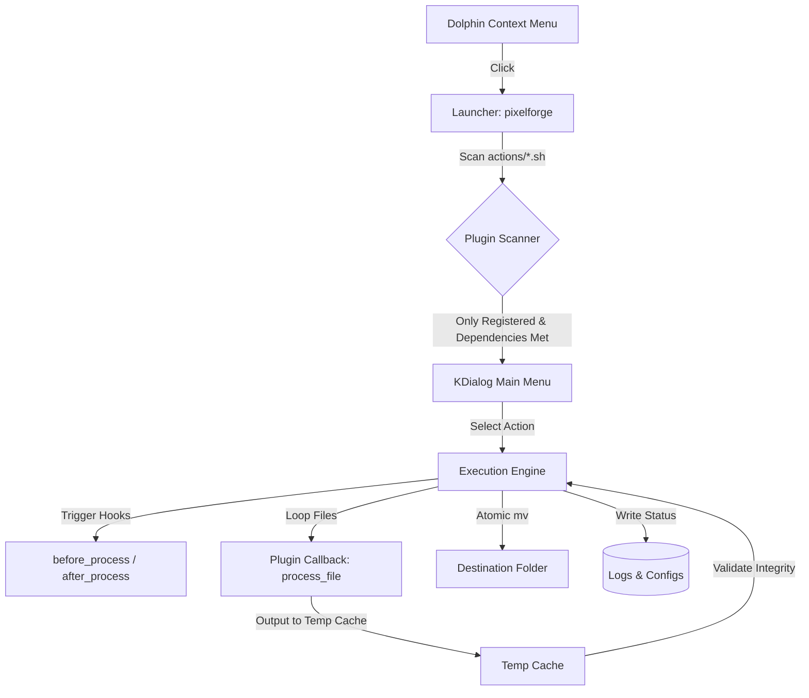

# PixelForge

PixelForge is a modular image processing suite integrated directly into the KDE Dolphin file manager as context menu actions. It provides batch resizing, format conversion, background removal, and GPU-accelerated super-resolution scaling directly from the right-click menu, without launching full GUI image editors.

Designed for Linux users who want command-line speed wrapped in a native KDE Plasma desktop integration.

---

## Features

- **Background Removal**: Extract subjects from images using local AI models (`isnet-anime`, `u2net_human_seg`, `isnet-general-use`, etc.) via `rembg`, with optional Alpha Matting.
- **Image Upscaling**: Scale images (2x, 4x, 8x, or custom percentages) using `waifu2x-ncnn-vulkan` with GPU/Vulkan acceleration.
- **Format Conversion**: Batch convert images between popular formats (`PNG`, `JPEG`, `WEBP`, `AVIF`, `TIFF`, `BMP`, `ICO`) with customizable quality profiles.
- **Batch Resizing**: Resize multiple images simultaneously, preserving aspect ratio or fitting specific width/height geometries.
- **Modular Plugin System**: Actions are dynamically discovered at runtime. Adding a new tool is as simple as creating a Bash script in the actions folder that adheres to the API contract.
- **Robust Execution Engine**: Features atomic file writing (via temp cache), physical integrity checks via ImageMagick (`identify`), structured logging, user configuration, and automatic dependency checks.

---

## Architecture

PixelForge uses a decoupled design where the launcher scans for actions, delegates options to KDE UI dialogs, and executes files through a structured pipeline.



---

## Dependencies

The core framework runs on Bash and standard KDE tools. Plugins enable themselves dynamically once their required backends are found in the system path.

| Dependency | Purpose | Required By | Arch Package / Installation |
| :--- | :--- | :--- | :--- |
| `bash` | Shell execution | Core Framework | `bash` |
| `kdialog` | Native dialogs | Core Framework | `kdialog` |
| `imagemagick` | Conversion, resizing, validation | Core, Resize, Convert, Upscale | `imagemagick` |
| `rembg` | Background removal | rembg action | `pipx install "rembg[cpu,cli]"` |
| `waifu2x-ncnn-vulkan` | Image upscaling | upscale action | `waifu2x-ncnn-vulkan` |

---

## Installation

### 1. Install Dependencies
On Arch Linux (or Garuda):
```bash
sudo pacman -S imagemagick waifu2x-ncnn-vulkan kdialog python-pipx

# Install rembg CLI with CPU backend
pipx install "rembg[cpu,cli]"
```

### 2. Clone the Repository
```bash
git clone https://github.com/Strashii/PixelForge.git
cd PixelForge
```

### 3. Link Executable and Desktop Entry
Set up the script directory and integration files locally:
```bash
# Create local bin directory if needed
mkdir -p ~/.local/bin

# Link the executable
ln -sf "$(pwd)/scripts/image-tools.sh" ~/.local/bin/pixelforge

# Copy the Dolphin service menu descriptor
mkdir -p ~/.local/share/kio/servicemenu/
cp servicemenu/pixelforge.desktop ~/.local/share/kio/servicemenu/
```

---

## Usage

### Dolphin Menu
1. Right-click any image file (or selection of files) in **Dolphin**.
2. Select **Image Tools** from the context menu.
3. Choose the action:
   - **Convert Format**: Export to WEBP, PNG, AVIF, etc.
   - **Resize**: Scale down by geometry presets or custom width.
   - **Remove Background**: Select the AI model, toggle Alpha Matting, and run.
   - **Upscale**: Choose scale factors (2x, 4x, 8x), denoise levels, and run.

### CLI Diagnostics
You can verify environment properties and dependency status:
```bash
pixelforge --doctor
```

Expected Output:
```text
==================================================
      PixelForge - Diagnostic Dashboard (v1.0.0)
==================================================
[+] KDE Plasma Session Detected: Wayland (Qt 6.7)
[+] Configuration File: ~/.config/dolphin-image-tools/config.conf
[+] Execution Log: ~/.cache/dolphin-image-tools/execution.log

Dependencies Status:
  - kdialog                   : Installed (/usr/bin/kdialog)
  - magick                    : Installed (/usr/bin/magick)
  - waifu2x-ncnn-vulkan       : Installed (/usr/bin/waifu2x-ncnn-vulkan)
  - rembg                     : Installed (~/.local/bin/rembg)

Registered Actions:
  - convert                   : [Active] (v1.0, API 1)
  - rembg                     : [Active] (v1.1, API 1)
  - resize                    : [Active] (v1.0, API 1)
  - upscale                   : [Active] (v1.1, API 1)
==================================================
```

---

## Roadmap

- [ ] **Job Chaining / Pipelines**: Chain multiple actions together (e.g., Resize -> Convert -> Optimize).
- [ ] **Image Optimization**: Integrated lossy/lossless compression wrappers (`jpegoptim`, `optipng`, `cwebp`).
- [ ] **Metadata Management**: View, strip, or copy Exif metadata using `exiftool`.
- [ ] **Interactive Cropping**: Lightweight crop GUI wrapper.
- [ ] **Parallel Processing**: Launch concurrent background jobs for batch runs.

---

## License

Distributed under the GPL-3.0 License. See the `LICENSE` file for details.
